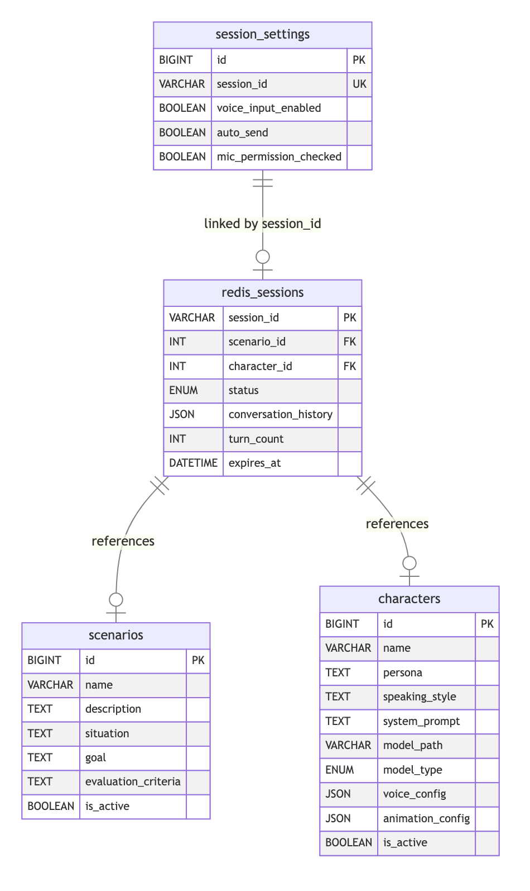

# データモデル

永続データは MySQL、会話セッションは Redis で管理します。

## ER図



> 図のソースは [diagrams/er-diagram.mmd](diagrams/er-diagram.mmd)（Mermaid）です。
> 更新時は次のコマンドで PNG を再生成してください。
>
> ```bash
> npx -y @mermaid-js/mermaid-cli -i docs/diagrams/er-diagram.mmd -o docs/diagrams/er-diagram.png -b white -s 2
> ```

## テーブル概要

| テーブル | 保存先 | 説明 |
|---------|--------|------|
| `scenarios` | MySQL | ロールプレイのシナリオ（状況・目標・評価基準） |
| `characters` | MySQL | キャラクターの人格・3Dモデル・音声/アニメーション設定 |
| `session_settings` | MySQL | セッションごとの UI 設定（音声入力・自動送信・マイク権限） |
| `redis_sessions` | Redis | 会話セッションの状態・履歴・ターン数・有効期限 |

各テーブルは共通で `created_at` / `updated_at`（Redis は `last_activity_at` / `expires_at` 等）を持ちます。

## 主なインデックス

| テーブル | インデックス | カラム | 種類 |
|---------|------------|--------|------|
| scenarios | PRIMARY | id | Primary Key |
| scenarios | ix_scenarios_name | name | Index |
| scenarios | ix_scenarios_is_active | is_active | Index |
| characters | PRIMARY | id | Primary Key |
| characters | ix_characters_name | name | Index |
| characters | ix_characters_is_active | is_active | Index |
| session_settings | uk_session_settings_session_id | session_id | Unique |

> 認証機能（`users` / `user_preferences`）は将来拡張として設計済みです。
